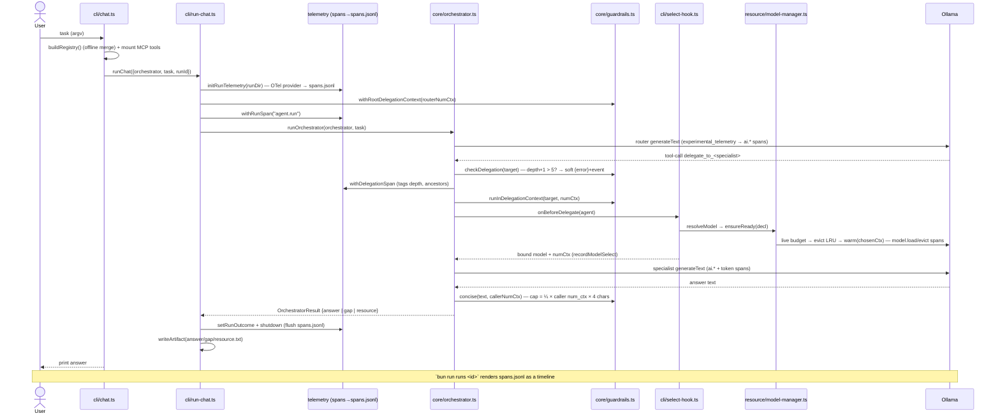

# Architecture

This is the **living** technical reference for the framework — a visual map of
how the system is wired and how data flows through it. For the product overview
see the [README](../README.md); for the long-range plan see
[`docs/ROADMAP.md`](ROADMAP.md); for the formal per-slice designs see
[`docs/superpowers/specs`](superpowers/specs).

> **Keep this current (standing obligation).** Every slice updates this doc as
> part of its work — treat a stale `architecture.md` as a slice defect. Each spec
> carries an "architecture-doc update" note alongside its "telemetry to emit"
> note. This is the structural counterpart to the **run-viewer** (which shows a
> single run at runtime); this shows how the whole system is wired.

---

## 1. Principles

- **Local-first, no API keys.** Models run locally (Ollama by default). Cloud is an opt-in backup only.
- **Autonomous & hardware-aware.** The system chooses a model, loads/unloads, sizes context, and records runs itself — budgeted to *live* RAM, never a frozen number.
- **Model freshness is runtime behavior, not a code change.** Agents declare a capability *requirement*; a selector resolves it against a registry that discovery refreshes per-machine. No model list is hardcoded in inference logic.
- **Compute live, env vars fallback-only.** RAM budget, `num_ctx`, KV sizing, and the delegated-return cap are all derived from live measurements; `AGENT_*` env vars are overrides/fallbacks, not the source of truth.
- **Observable by default.** Every subsystem that does meaningful work emits OpenTelemetry spans/events through `src/telemetry/spans.ts` (§7). The run-viewer and any OSS backend get new signal for free.
- **Safe composition.** Delegation is bounded by a depth limit (termination guarantee) and a live per-return size cap (§8), so deep multi-agent graphs can't compound cost/loops.
- **Small, modular, plain code; ports & adapters.** One responsibility per file; runtime (Ollama/MLX) and tool source (MCP) sit behind interfaces.

---

## 2. System map (modules & dependencies)

The engine is **Vercel AI SDK 6** (runtime-agnostic `LanguageModel`, the
tool-calling loop, MCP client, mock model, and `experimental_telemetry`). We
write only the thin layers on top.

```mermaid
graph TD
    subgraph CLI["CLI · src/cli"]
        chat["chat.ts (entry)"]
        runchat["run-chat.ts"]
        selhook["select-hook.ts"]
        selrt["select-runtime.ts · createSelectionRuntime"]
        runscli["runs.ts · bun run runs"]
        flow["flow.ts · bun run flow"]
        crewcli["crew.ts · bun run crew"]
    end
    subgraph CORE["Core · src/core"]
        orch["orchestrator.ts"]
        delegate["delegate.ts"]
        agent["agent.ts · runAgent loop"]
        guard["guardrails.ts · ALS depth+budget"]
        types["types.ts · 4-axis taxonomy"]
    end
    subgraph RES["Resource · src/resource"]
        mgr["model-manager.ts"]
        sel["selector.ts"]
        hw["hardware.ts · live budget"]
        kv["kv-cache.ts"]
        octl["ollama-control.ts"]
    end
    subgraph RT["Runtime · src/runtime"]
        reg["registry.ts · runtimeFor"]
        ortime["ollama.ts"]
        mlx["mlx-server.ts"]
    end
    subgraph DISC["Discovery · src/discovery"]
        discover["discover.ts"]
        buildreg["build-registry.ts"]
        hfsrc["hf-gguf / hf-mlx"]
    end
    subgraph MCP["MCP · src/mcp"]
        mcpclient["client.ts · mountMcpServer"]
    end
    subgraph TEL["Telemetry · src/telemetry"]
        spans["spans.ts · ATTR + helpers"]
        provider["provider.ts · OTel provider"]
        exporter["jsonl-exporter.ts"]
    end
    subgraph RUN["Run store · src/run"]
        runstore["run-store.ts"]
        runtrace["run-trace.ts"]
    end
    subgraph WF["Workflow · src/workflow"]
        wftypes["types.ts · StepKind"]
        wfdefine["define.ts · defineWorkflow"]
        wfengine["engine.ts · runWorkflow"]
        wfrunstep["run-step.ts · runStepByKind"]
    end
    subgraph CREW["Crew · src/crew"]
        crewtypes["types.ts · CrewMember/Task/CrewProcess"]
        crewdefine["define.ts · defineCrew"]
        crewmember["member-agent.ts · buildCrewAgent"]
        crewcompile["compile.ts · compileToWorkflow/buildHierarchicalOrchestrator"]
        crewengine["engine.ts · runCrew"]
    end
    subgraph DATA["On-disk · git-ignored"]
        spansfile[("runs/&lt;id&gt;/ spans.jsonl + .txt")]
        images[("model-images/ + catalog.json")]
    end
    subgraph DECL["Declarations (pure data)"]
        agents["agents/*"]
        models["models/* · BOOTSTRAP"]
        workflows["workflows/* · WORKFLOWS"]
        crews["crews/* · CREWS"]
    end

    chat --> runchat
    chat --> selhook
    chat --> buildreg
    chat --> agents
    chat -. mounts .-> mcpclient
    runchat --> orch
    runchat --> provider
    orch --> delegate
    delegate --> guard
    delegate --> agent
    delegate --> spans
    agent --> spans
    selhook --> sel
    sel --> mgr
    mgr --> reg
    mgr --> hw
    mgr --> kv
    mgr --> spans
    reg --> ortime
    reg --> mlx
    ortime --> octl
    buildreg --> reg
    buildreg --> models
    discover --> hfsrc
    discover --> reg
    discover --> images
    agents -. hold tools .-> mcpclient
    spans --> provider
    provider --> exporter
    exporter --> spansfile
    octl --> images
    runscli --> runtrace
    runtrace --> spansfile
    flow --> wfengine
    flow --> runstore
    flow -. mounts .-> mcpclient
    flow --> agents
    flow --> workflows
    flow --> selrt
    wfengine --> wfrunstep
    wfrunstep --> delegate
    wfengine --> spans
    wfrunstep --> spans
    wfdefine --> wftypes
    crewengine --> crewcompile
    crewcompile --> crewmember
    crewcompile --> wfdefine
    crewmember --> sel
    crewengine --> wfengine
    crewengine --> orch
    crewengine --> spans
    crewdefine --> crewtypes
    crewtypes --> wftypes
    crewcli --> crewengine
    crewcli --> runstore
    crewcli -. mounts .-> mcpclient
    crewcli --> crews
    crewcli --> selrt
    selrt --> selhook
    selrt --> buildreg
    selrt --> mgr
    runstore --> spansfile
```

| Layer | Files | Responsibility | Knows about |
|---|---|---|---|
| **CLI** | `src/cli/` | Entry + orchestration of one run; `runs` viewer; deterministic-workflow entry (`flow.ts`); crew entry (`crew.ts`); shared live-selection runtime builder (`select-runtime.ts`, extracted from `chat.ts`'s inline wiring, reused by `flow.ts` + `crew.ts`) | everything below |
| **Core** | `src/core/` | Agent loop (`agent.ts`), orchestrator (agents-as-tools), `delegate.ts`, **`guardrails.ts`** (depth + return cap), taxonomy (`types.ts`), errors | AI SDK + telemetry |
| **Resource** | `src/resource/` | Live RAM budget, footprint, dynamic `num_ctx`, KV sizing/risk, warm/unload, selector | Ollama HTTP + `os` |
| **Runtime** | `src/runtime/` | Runtime port + Ollama-GGUF & MLX-server adapters; `createModel` per declaration | AI SDK + provider HTTP |
| **Providers** | `src/providers/` | Builds a concrete AI SDK `LanguageModel` from a declaration (the Ollama provider binding, `createOllamaModel`) used by the runtime adapters | AI SDK + Ollama provider |
| **Discovery** | `src/discovery/` | Host detector, HF catalog sources, offline `buildRegistry`, `runDiscovery` | Hugging Face HTTP + `os` |
| **Telemetry** | `src/telemetry/` | OTel provider, span helpers (`ATTR` + `withXSpan`/`recordX`), JSONL exporter — the **extensible** observability layer | OpenTelemetry SDK |
| **Tools / MCP** | `src/tools/`, `src/mcp/` | Define tools; mount/consume MCP servers | MCP SDK + AI SDK MCP client |
| **Run store** | `src/run/` | Per-run dir + artifacts (`run-store.ts`); span reader/tree (`run-trace.ts`) | filesystem |
| **Declarations** | `models/`, `agents/`, `workflows/`, `crews/` | Data: which model / which agent / which workflow DAG / which crew (`crews/index.ts` `CREWS` + `getCrew`, mirrors `workflows/index.ts`; `research-crew.ts` is the reference sequential example) | nothing (pure data) |
| **Workflow / DAG** | `src/workflow/` | Deterministic multi-step engine (Slice 10): step types + `StepKind` (`types.ts`), construction-time DAG validation (`define.ts`), topological execution with bounded concurrency (`engine.ts`), per-kind step dispatch (`run-step.ts`) | `core/delegate.ts` (`runGuardedAgent`) + `telemetry/spans.ts` + Zod (I/O schemas) |
| **Crew / Roles** | `src/crew/`, `src/cli/crew.ts`, `crews/` | Team-of-agents orchestration layer (Slice 11): typed crew model + task graph (`types.ts`), crew-definition validation (`define.ts`), member → `Agent` construction (`member-agent.ts`), compile to a `WorkflowDef` (sequential) or an orchestrator `Agent` (hierarchical) (`compile.ts`), `runCrew` dispatcher under a `crew.run` span (`engine.ts`); CLI entry `runCrewCli`/`main()` (`src/cli/crew.ts`, `bun run crew <name> [input...]`) mirrors `runFlow`/`flow.ts` — `createRun` → `initRunTelemetry` → `runCrew` → `writeArtifact('result.txt'\|'failed.txt')` → `shutdown()`; both `crew.ts` and `flow.ts` build live model selection via `createSelectionRuntime()` (`select-runtime.ts`) and pass `onBeforeDelegate` into their agent steps | `workflow/engine.ts` (sequential) + `core/orchestrator.ts` + `core/delegate.ts` (hierarchical + live model selection via `onBeforeDelegate`) + `resource/selector.ts` (indirectly, via the same hook) + `cli/select-runtime.ts` |

**Key decoupling:** `core/agent.ts` takes a generic `ToolSet` — it doesn't know tools come from MCP. Same agent code is unit-tested with an in-process tool + mock model, and run for real with MCP-sourced tools.

---

## 3. Runtime data flow (one `chat` run, current)

A delegation that would exceed depth 5 returns a **soft** `{error}` the orchestrator can adapt to (not a crash); recursion (a repeated agent name) is allowed — depth is the bound. Every step above is captured as a nested OTel span.

---

## 4. Resource model (Apple Silicon)

Live budgeting + dynamic context sizing (Slices 4–5, 7).

**Live budget (`liveBudgetBytes`, `src/resource/hardware.ts`):** `min(0.75 × total RAM, 0.8 × live free RAM)` (the first term is the Metal cap, `machineBudgetBytes()`), recomputed every delegation. Live free RAM = `availableRamBytes()` parsing `vm_stat` (`free + inactive + speculative + purgeable`); falls back to `os.freemem()` → half total. Fractions overridable via `AGENT_GPU_BUDGET_FRACTION` / `AGENT_FREE_BUDGET_FRACTION` (fallback-only).

**Footprint (`src/resource/footprint.ts`):** `weightsBytes(paramsB, bytesPerWeight)` = `paramsB × 1e9 × bytesPerWeight × 1.2` (1.2 = `RUNTIME_OVERHEAD`); `kvCacheBytes(tokens, kvBytesPerToken)`.

**Dynamic `num_ctx` (`src/resource/model-manager.ts`):** `chosenCtx = min(desired, modelMax, maxCtxByFit)`, floor `MIN_CTX=4096`, rounded to `CTX_ROUNDING=1024`. `modelMax` probed live via `POST /api/show` (`model_info["<arch>.context_length"]`); `maxCtxByFit = floor((headroom − weights) / kvPerToken)`. The same `chosenCtx` is used for warm AND inference (no runner reload).

**Manager state** (all keyed by the **model string**, so two agents sharing a model share one resident copy): `lastUsed` (LRU), `chosenCtxByModel`, `maxCtxByModel`, `runtimeByModel`, `kvF16ByModel`, `kvRiskWarned`. `ensureReady` = check installed/loaded → compute min footprint → evict LRU non-pinned (then pinned, best-effort, as last resort) → size ctx → `withModelLoadSpan(c.warm)`. Control via Ollama HTTP (`ollama-control.ts`): warm/unload = `POST /api/generate`, list = `GET /api/ps`, probes = `POST /api/show`.

### KV-cache quantization (Slice 7)
Global type via `AGENT_KV_CACHE_TYPE` (default `q8_0`) + `OLLAMA_FLASH_ATTENTION=1`, both set by `scripts/serve.sh`. Per-model f16 baseline from `/api/show` arch: `f16KvBytesPerToken = block_count × head_count_kv × (key_length + value_length) × 2`; `effectiveKvBytesPerToken` × type multiplier (`f16`→1.0, `q8_0`→0.5, `q4_0`→0.25). Arch-derived risk advisory: `key_length ≤ 64` (small head_dim) **or** `expert_count > 0` (MoE) — no model-family names anywhere.

### Dynamic model selection (Slice 5)
`selectCandidates` (pure: capability hard-filter → largest-that-fits → warm-aware tie-break) → `resolveModel` (live fallback loop against `ensureReady`, the single fit-authority; `ResourceError` → next candidate). Bound lazily at delegation via `onBeforeDelegate` (`src/cli/select-hook.ts`) which also prints the one-line selection notice. A genuine no-fit → `ResourceCapture` seam → `runOrchestrator` returns `{kind:'resource'}` → non-zero exit (never a hallucinated answer).

---

## 5. Discovery & runtimes (Slice 6)

**Runtime port** (`src/runtime/runtime.ts`): `RuntimeControl` (`isInstalled`/`pull`/`warm`/`unload`/`listLoaded`/`getModelMax`/`getModelKvArch`) + `Runtime` (`kind`/`isAvailable`/`createModel`/`control`). Adapters: **Ollama** (`ollama.ts`, Tier-1) and **MLX server** (`mlx-server.ts`, OpenAI-compatible at `MLX_BASE_URL` default `:1234/v1`; server owns lifecycle). `registry.ts`: `runtimeFor(kind)` / `availableRuntimes()`.

**Catalog sources** (`CatalogSource`): `hf-gguf` + `hf-mlx` (trusted publishers, tool-capability via `chat_template`, best-fitting quant via `quant.ts`). `detectHost()` probes live budget + available runtimes; `appliesTo(host)` gates each source.

**`runDiscovery`** (`discover.ts`): detect host → list candidates per source (skip failures) → dedupe by `(provider, repo)` → rank (downloads, then params) → write `model-images/catalog.json` (atomic) → pre-pull top-1.

**`buildRegistry`** (`build-registry.ts`, offline-safe): merge **bootstrap** (`models/registry.ts` `BOOTSTRAP`) ∪ **installed** (live `listLoaded`) ∪ **cached catalog** (filtered to installed-only). This is the registry `resolveModel` uses at chat time — no network on the chat path.

### Four axes (`src/core/types.ts`)
| Axis | Values | Enum |
|---|---|---|
| Capability / modality | Tools, Vision, Audio, Video | `Capability` |
| Runtime | Ollama, MlxServer | `ProviderKind` |
| Content policy | Default, Uncensored *(seam)* | `ContentPolicy` |
| Source | hf-gguf, hf-mlx | `CatalogSource.name` |

---

## 6. Why Ollama

We use **llama.cpp through Ollama** — it wraps the engine (and Apple MLX on 32 GB+ Macs) and adds model management (`pull`/`ps`, auto-quant), an HTTP control API the resource manager drives, tool-calling, and a clean AI SDK provider. Because the model layer is runtime-agnostic, Ollama is just the default **Tier-1 adapter**; a raw `llama.cpp-server` or dedicated MLX-server can slot behind the same `Runtime` interface with no agent code change.

---

## 7. Observability — telemetry & run-viewer (Slice 8)

Each run is an **OpenTelemetry trace** written to `runs/<id>/spans.jsonl`, viewable with a terminal run-viewer. This is the **extensible layer every later feature emits into** (the "observable by default" principle).

- **`provider.ts`** — `initRunTelemetry(runDir)` registers a per-run, Bun-safe `BasicTracerProvider` + `AsyncLocalStorageContextManager` (no Node auto-instrumentation), and processors via `buildProcessors`: a `JsonlFileExporter` always, **plus** an OTLP/HTTP exporter when `AGENT_OTLP_ENDPOINT` is set (the swappable-backend seam → Jaeger/Tempo/Phoenix). `recordIoEnabled()` gates prompt/response capture (`AGENT_TELEMETRY_RECORD_IO`).
- **`jsonl-exporter.ts`** — a `SpanExporter` serializing each span to one JSON line (`SpanRecord`); writes are serialized through a promise chain and **flushed on `shutdown()`** so `spans.jsonl` is never truncated.
- **`spans.ts`** — the API: the **`ATTR`** key registry + helpers `withRunSpan` / `setRunOutcome` / `withDelegationSpan` / `recordModelSelect` / `withModelLoadSpan` / `recordEvict` / `recordGuardrailViolation` / `withWorkflowSpan` / `withStepSpan` / `annotateStep` (the last three back the workflow/DAG engine, §9). **AI-SDK** `experimental_telemetry` (enabled per `generateText` with `functionId = agent.name`) contributes `ai.generateText` / `ai.toolCall` / token spans for free, nested under our manual spans via the active context.

**Run-viewer** (`bun run runs`, `src/cli/runs.ts`): `runs` lists runs (newest-first); `runs <id>` renders the span tree as an indented timeline (model · duration · tokens · outcome); `--follow` tails the live run. Reader/renderer are pure (`src/run/run-trace.ts` `readSpans`/`buildTree`/`summarizeRun`; `src/cli/render-trace.ts`). `journal.jsonl` is retired — `spans.jsonl` is canonical; `answer/gap/resource.txt` artifacts remain.

**Extending telemetry (standing rule):** a new subsystem adds a `withXSpan`/`recordX` helper + `ATTR` keys here — the transport (provider/exporter) and the OTLP seam are untouched, and both the local viewer and any backend get the new signal for free.

---

## 8. Composition guardrails (Slice 9)

The safe-composition foundation for the future workflow/crew engine. Each delegation is a fresh, isolated `generateText` instance, so the risks are **non-termination** and **cost**, not state corruption — both bounded by depth. Backed by an `AsyncLocalStorage<DelegationContext>` (`{depth, ancestors, numCtx}`) in `src/core/guardrails.ts`, enforced at the single delegation chokepoint (`delegate.ts`).

- **Depth limit (the termination guarantee).** `checkDelegation` rejects when `current.depth + 1 > maxDelegationDepth()` (default 5, `AGENT_MAX_DELEGATION_DEPTH`). Every hop goes through `runInDelegationContext` (depth++), and the orchestrator root is seeded via `withRootDelegationContext` — so **no chain can bypass the counter**; any chain (incl. self-recursion) terminates ≤ depth levels. **Recursion is allowed** (no name-based cycle ban — that would forbid legitimate recursive decomposition); ancestry is carried for telemetry only.
- **Live return cap.** `concise(text, callerNumCtx)` caps a delegated return to `floor(returnCtxFraction() × callerNumCtx × 4 chars/token)` — a fraction (default 0.25, `AGENT_RETURN_CTX_FRACTION`) of the **consumer's** live `num_ctx`, captured from the parent frame before entering the child. Not a flat constant — it scales with the same hardware-aware budget as everything else.
- **Soft failure.** Violations return `{ error }` from the delegate tool (the existing soft-tool-error path) so the calling agent's LLM can adapt, plus an `agent.guardrail.violation` span event. `withDelegationSpan` tags `agent.delegation.depth` / `agent.delegation.ancestors` (visible in `bun run runs`).
- **Warm-model reuse** is already provided by the manager (state keyed by model string); locked in by a regression test.

---

## 9. Workflows / DAG engine (Slice 10)

**Pure types + execution model for deterministic multi-step workflows.** While the agent loop is *agentic* (an LLM autonomously chooses actions), workflows are *choreographed* — steps run in a defined DAG order, each produces validated output, and branches/maps are explicit.

- **Types** (`src/workflow/types.ts`): 
  - `enum StepKind { Agent, Tool, Branch, Map }` — the four step kinds
  - `WorkflowContext` — thread of `{stepId: output}` through a run; maps + branches thread `item`/`index`
  - Step variants: `AgentStep` (run an agent, input is a prompt), `ToolStep` (call a tool, input is args), `BranchStep` (if-then-else on a predicate), `MapStep` (fan-out per item in a list, run sub-step once per item)
  - `StepError` — per-step failure policy: `'fail'` (fast), `'continue'` (skip on error), `{ fallback }` (use a fallback value)
  - `WorkflowDef` — a named list of steps + metadata
  - `WorkflowOutcome` — `{ kind: 'done', output }` or `{ kind: 'failed', failedStep, message }`
  - `effectiveDeps(step, index, steps)` — helper: explicit `dependsOn` or implicit previous-step deps

- **Error class** (`src/core/errors.ts`): `WorkflowError extends FrameworkError` for workflow-specific failures (bad definition, step failure, context mismatch)

- **Telemetry** (`src/telemetry/spans.ts`) — extended per the standing rule (§7): `withWorkflowSpan(workflowId, fn)` opens the root `workflow.run` span (`ATTR.WORKFLOW_ID`); `withStepSpan(stepId, kind, fn)` opens a nested `workflow.step` span per step (`ATTR.STEP_ID` / `ATTR.STEP_KIND`); `annotateStep(attrs)` tags the active step span with extra attributes (`ATTR.STEP_BRANCH_TAKEN` for the branch taken, `ATTR.STEP_MAP_COUNT` for map fan-out size); `ATTR.WORKFLOW_OUTCOME` records the terminal `WorkflowOutcome`. These are the spans/attrs the execution engine (Task 6) and CLI (Task 7) emit into — transport untouched, so the run-viewer and any OTLP backend get workflow signal for free.

- **Step runner** (`src/workflow/run-step.ts`): `runStepByKind(step, ctx, deps)` dispatches a step to its kind (agent/tool/branch/map) and returns the *raw*, unvalidated result; `WorkflowDeps` (`runAgentStep`, `tools`, `maxParallel`) is the injected boundary the engine and CLI provide; `mapWithConcurrency` bounds fan-out concurrency for `MapStep` (default cap `DEFAULT_MAX_PARALLEL`, overridable via `AGENT_WORKFLOW_MAX_PARALLEL` or per-map `maxParallel`).

- **Execution engine** (`src/workflow/engine.ts`): `runWorkflow(def, input, deps)` seeds `ctx = { input }` and runs the DAG wave-by-wave — each wave collects every step whose `effectiveDeps` are `done` (bounded per-wave by `maxParallel`), runs them concurrently inside `withStepSpan`, and validates each raw result against the step's `output` zod schema. A step whose dependency was skipped is itself marked skipped (cascading dead-arm/`continue` propagation through descendants). On step error, the `onError` policy decides the outcome: `'fail'` (default) stops the run and returns `{kind:'failed', failedStep, message}`; `'continue'` marks the step skipped; `{fallback}` seeds `ctx[step.id]` with the fallback value and marks the step *done* (so downstream steps still see it as satisfied). After a `BranchStep` resolves, the non-taken target is added to `skipped`. The engine never throws to its caller — all step errors are caught and resolved through the policy above — and returns `{kind:'done', output: ctx}` once no further step is ready.

- **Definition + validation** (`src/workflow/define.ts`): `defineWorkflow(def)` validates a `WorkflowDef` at construction time — unique step ids, every `dependsOn`/branch target resolves to a real step, and the dependency graph is acyclic (Kahn's algorithm) — throwing `WorkflowError` on any violation, so a malformed workflow fails fast at import time rather than mid-run.

- **Registry** (`workflows/index.ts`, `workflows/fetch-then-summarize.ts`): `WORKFLOWS: Record<string, WorkflowDef>` + `getWorkflow(name)` — mirrors `models/registry.ts`. `fetch-then-summarize` is the reference example: a `tool` step (`fetch`, via `mcp-server-fetch`) feeding a `web_fetch` `agent` step that summarizes the fetched content.

- **CLI entry** (`src/cli/flow.ts`): `bun run flow <name> [input...]` — the workflow analog of `chat.ts`/`run-chat.ts`. `runFlow(deps)` follows the same lifecycle as `runChat`: `createRun` → `initRunTelemetry` → `withWorkflowSpan(def.id, …)` wrapping `runWorkflow` → on `done`, `annotateStep({[ATTR.WORKFLOW_OUTCOME]: outcome.kind})` then `writeArtifact('result.txt', <last step's output>)`; on `failed`, `writeArtifact('failed.txt', "step <id>: <message>")` — all still inside the `workflow.run` span so the outcome attribute lands on it; `shutdown()` in `finally`. `main()` mounts file+fetch MCP tools, builds the `agents` map from `createFileQaAgent`/`createWebFetchAgent` keyed by `.name`, resolves the workflow via `getWorkflow`, builds the shared live-selection runtime (below) and prints the last step's output (or the failure) to stdout/stderr — closing the selection runtime, then the fetch server, then the file server in `finally`, mirroring `chat.ts`'s mount/close order.

- **Shared live-selection runtime** (`src/cli/select-runtime.ts`, Slice 11 Task 7): `createSelectionRuntime(opts?)` extracts `chat.ts`'s inline manager + offline `buildRegistry()` + `createSelectHook` + one-line selection `notify` into a single reusable async factory, returning `{ onBeforeDelegate, capture, close }`. `close()` calls `manager.unloadAll()`. Both `flow.ts`'s and `crew.ts`'s `main()` build one runtime per CLI invocation (nested inside the mounted file/fetch MCP servers, closed in `finally`) and thread `onBeforeDelegate` into `defaultRunAgentStep`/`runCrew` respectively — so a workflow agent step or a crew member is resolved to the largest model that fits the *live* RAM budget at delegation time, the same guarantee `chat.ts` gives its orchestrator. `chat.ts` itself is left with its original inline wiring in this slice; deduping it against `select-runtime.ts` is a follow-up.

- **Crew CLI entry** (`src/cli/crew.ts`, Slice 11 Task 7): `bun run crew <name> [input...]`. `runCrewCli(deps)` mirrors `runFlow`'s lifecycle exactly: `createRun` → `initRunTelemetry` → `runCrew(def, input, {tools, onBeforeDelegate, runAgentStep})` → on `done`, `writeArtifact('result.txt', <output as text or pretty JSON>)`; on `failed`, `writeArtifact('failed.txt', "task <id>: <message>")` → `shutdown()` in `finally`. `deps.runAgentStep` is an optional test seam (bypasses a real model in unit tests, same pattern `runWorkflow` uses). `main()` resolves the crew via `getCrew` (`crews/index.ts`), mounts file+fetch MCP tools, builds a `createSelectionRuntime()` and passes `onBeforeDelegate` into `runCrewCli`, then prints the crew's final output (or failure) to stdout/stderr.

---

## 10. On-disk stores

- **`runs/<runId>/`** (git-ignored) — `spans.jsonl` (the OTel trace, canonical) + `answer.txt` / `gap.txt` / `resource.txt` (human-facing artifacts). `runId = run-<pid>`. Read by the run-viewer; override the root with `AGENT_RUNS_ROOT` (tests).
- **`model-images/`** (git-ignored) — the project-local Ollama model store (`OLLAMA_MODELS`, set by `serve.sh`) + `catalog.json` (discovery output: `{ writtenAt, candidates[] }`, atomic temp+rename).

---

## 11. Testing strategy

- **Agent loop / core** — `MockLanguageModelV3` (no model needed); step-ceiling → `MaxStepsError`.
- **Guardrails** — pure unit tests (depth allow/reject, recursion-allowed, live `returnCapChars`, `concise`, ALS propagation) + a synthetic multi-hop `delegate.test.ts` (an agent given a delegate tool) proving over-depth soft-error + event and the live cap, since real multi-hop isn't reachable yet.
- **Telemetry** — `tests/helpers/otel-test-provider.ts` `registerTestProvider()` (InMemory exporter); asserts spans/events/attrs; a Bun ALS-nesting smoke test.
- **Resource / Ollama control** — `fetch` mocked; bodies/URLs asserted; warm-reuse regression (two agents, one warm).
- **MCP** — real stdio round-trip (subprocess server).
- **Live** (`*.live.test.ts`, skip when the dep is down) — `orchestrator`, `model-manager`, `selection`, `kv-cache`, `fetch-mount`, `run-viewer`, `workflow`, `crew` (real Ollama); `discover` (real HF); `mlx` (needs an MLX server).

---

## 12. Glossary

- **Agents-as-tools** — the orchestrator (`agents/super.ts` via `createOrchestrator`) exposes `delegate_to_<name>(task)` tools wrapping sub-agents + `report_capability_gap`. Routing = the router model's tool choice. `runOrchestrator` returns `{answer|gap|resource}` (resource/gap take precedence over an answer, read from `steps` even when the step guard trips).
- **Run** — one invocation under `runs/<id>/`: an OTel trace (`spans.jsonl`) + text artifacts.
- **Span / trace** — OpenTelemetry units. A run = a root `agent.run` span; delegations, model loads, and AI-SDK `generateText`/tool calls nest beneath it via the active async context. `bun run runs` renders the tree.
- **Delegation context** — the `AsyncLocalStorage` `{depth, ancestors, numCtx}` threaded through every hop; basis for the depth guard, the live return cap (off the parent's `numCtx`), and the `delegation.depth`/`ancestors` span attrs.
- **Live budget** — `min(0.75 × total RAM, 0.8 × availableRamBytes())` (first term = the Metal cap), recomputed per delegation; `availableRamBytes()` parses `vm_stat`.
- **Dynamic num_ctx** — `min(desired, modelMax, maxCtxByFit)`, floor 4096, rounded 1024; `modelMax` probed live via `/api/show`; same value for warm + inference.
- **Model Manager** — `src/resource/model-manager.ts`; `ensureReady` drives the lifecycle within live budget and returns the chosen context. State keyed by model string ⇒ shared-model agents = one resident copy.
- **Mounting an MCP server** — `mountMcpServer({command,args})` connects to any stdio MCP server and returns `{tools, close}`. Capability = pointing at a server, not writing tool code. `createFileTools` (native `read_file`) + `createFetchTools` (`uvx mcp-server-fetch`) are presets.
- **Declaration** — a data file describing a model (provider + name + params + footprint) or an agent. Not weights, not logic.
