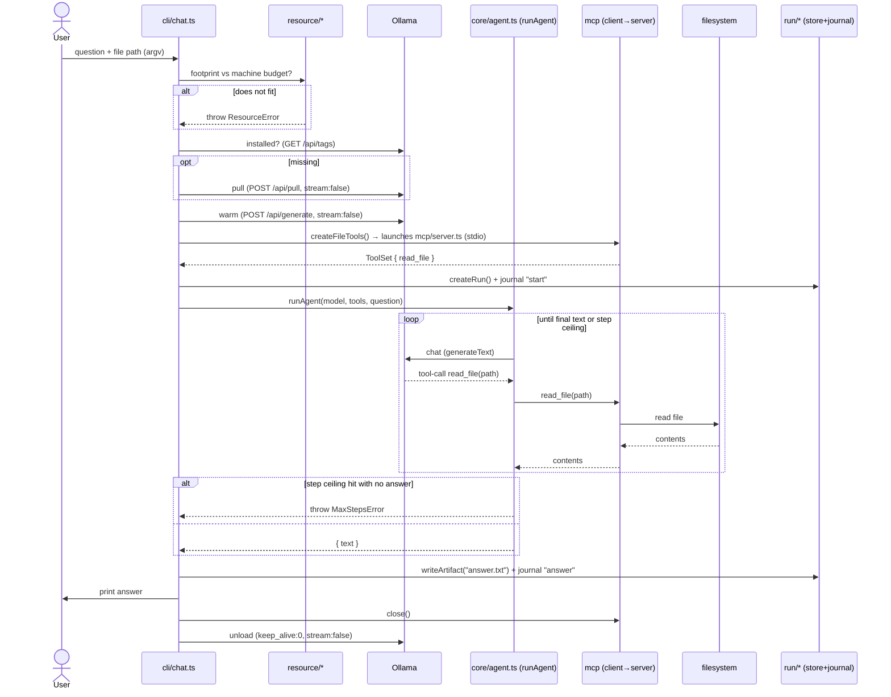

# Architecture

This is the living technical reference for the framework. It will grow as the
system does. For the product overview, see the [README](../README.md); for the
formal designs, see [`docs/superpowers/specs`](superpowers/specs).

---

## 1. Principles

- **Local-first, no API keys.** Models run locally (Ollama by default). Cloud is
  an opt-in backup only.
- **Autonomous.** The system takes actions itself — choosing a model, loading /
  unloading, sequencing work, recording runs. The user is never required to do
  manual steps. (If memory is genuinely too tight, the planned escalation is:
  degrade first → if still tight, ask once → on approval reclaim everything
  except a protected set. Never silent.)
- **Model freshness is runtime behavior, not a code change.** Model choices are
  *data* (a declaration), and Slice 3 adds discovery that fetches the latest
  models per machine — no hardcoded model list in logic.
- **Small, modular, plain code.** One responsibility per file, loose coupling,
  self-explanatory code. The layers below each have a narrow interface.
- **Ports & adapters.** Runtime (Ollama) and tool source (MCP) sit behind
  interfaces, so they're swappable and testable.

---

## 2. Layers

The engine is **Vercel AI SDK 6** — it provides the runtime-agnostic
`LanguageModel` interface, the tool-calling loop, parallel tool calls, an MCP
client, and a mock model for tests. We write only the thin layers on top.

| Layer | Files | Responsibility | Knows about |
|---|---|---|---|
| **CLI** | `src/cli/` | Entry + orchestration of one run | everything below |
| **Agent** | `src/core/agent.ts` | The tool-calling loop with a step guard | AI SDK only (model + `ToolSet`) |
| **Providers** | `src/providers/` | Build a `LanguageModel` from a declaration | AI SDK + Ollama provider |
| **Resource** | `src/resource/` | Budget, footprint, warm/unload | Ollama HTTP + `os` |
| **Tools / MCP** | `src/tools/`, `src/mcp/` | Define tools; expose & consume over MCP | MCP SDK + AI SDK MCP client |
| **Run store** | `src/run/` | Per-run dir, artifacts, resumable journal | filesystem |
| **Declarations** | `models/`, `agents/` | Data: which model / which agent | nothing (pure data) |

**Key decoupling:** `core/agent.ts` accepts a generic `ToolSet`. It does **not**
know tools come from MCP. That's why the loop is unit-tested with an in-process
tool + the mock model (fast, no infra), while the real CLI feeds it MCP-sourced
tools. Same agent code, two wirings.

---

## 3. Data flow (Slice 1: file Q&A)

---

## 4. Resource model (Apple Silicon)

- **Budget = ~75% of unified memory** (the Metal GPU working-set / wired limit),
  not `os.freemem()` (unreliable on macOS). See `resource/hardware.ts`.
- **Footprint estimate** = `params × bytes-per-weight × 1.2` (runtime overhead)
  `+ KV-cache` (grows with context). See `resource/footprint.ts`.
- **Control** via Ollama HTTP: warm = empty-prompt `POST /api/generate`
  (`stream:false`); pin = `keep_alive:-1`; unload = `keep_alive:0`; inspect =
  `GET /api/ps`. Note: write requests use the field `model`; `/api/tags` and
  `/api/ps` report it back as `name`.
- Slice 1 uses a static budget check + warm + unload for one model. Slice 3 adds
  the scheduler (concurrent-vs-sequential multi-model loading), dynamic model
  selection, and memory reclaim.

---

## 5. Why Ollama

We are using **llama.cpp — through Ollama.** Ollama wraps the llama.cpp engine
(and Apple's MLX on 32 GB+ Macs) and adds the parts an agent system needs:
model management (`pull`/`list`/`ps`, auto-quantization), an HTTP control API
(warm/`keep_alive`/unload/`ps`) that the **autonomous resource manager** drives,
first-class tool-calling, and a clean AI SDK provider. Building those on raw
llama.cpp would mean hand-rolling model management and an HTTP layer — more code,
exactly the kind we avoid.

Because the model layer is runtime-agnostic (AI SDK `LanguageModel`), Ollama is
just the default **Tier-1 adapter**. A raw **llama.cpp-server** adapter or a
dedicated **MLX-server** (omlx / vMLX, for persistent KV-cache or high
concurrency) can be added behind the same interface later — no agent code
changes. MLX is not a separate "later" item for the common path: on 32 GB+
Apple Silicon, Ollama 0.19+ already runs on an MLX backend.

---

## 6. Testing strategy

- **Agent loop** — tested against AI SDK 6's `MockLanguageModelV3`: scripts a
  tool-call turn then a final-text turn, asserting the tool executed with parsed
  args and the final text returned; plus a step-ceiling test asserting
  `MaxStepsError`. No model required.
- **Resource / Ollama control** — `fetch` is mocked; request bodies/URLs asserted.
- **Run store / journal / tool** — real temp dirs and files (real I/O).
- **MCP** — a **real round-trip**: spawns `mcp/server.ts` as a subprocess over
  stdio, discovers `read_file` through the AI SDK MCP client, reads a real file.
- Tests need **no Ollama**; the only step that does is the manual end-to-end CLI
  run.

---

## 7. Glossary

- **Declaration** — a small data file describing a model (provider + name +
  params + role) or an agent. Not weights, not logic.
- **Model image** — the on-disk model blob/weights (GGUF). Lives in
  `model-images/` (git-ignored) or `~/.ollama`.
- **Agents-as-tools** — the orchestration pattern (Slice 2): the super-agent is
  an agent whose tools delegate to other agents.
- **Run** — one invocation, recorded under `runs/<id>/` with artifacts + a
  JSONL journal (resumable).
