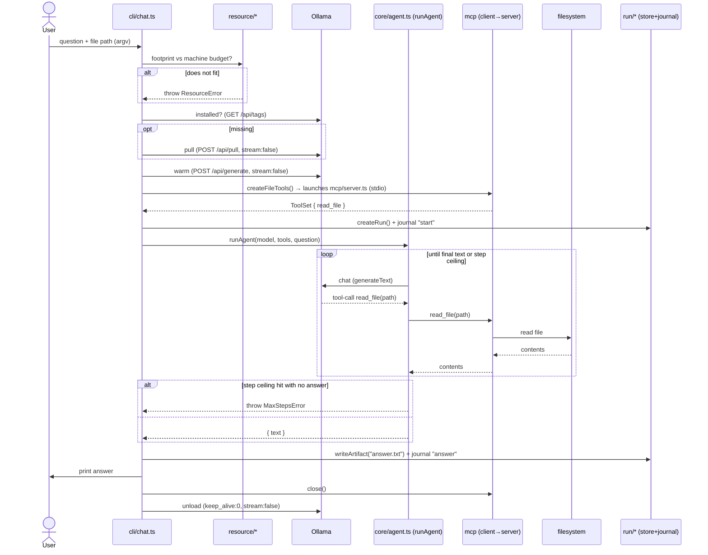

# Architecture

This is the living technical reference for the framework. It will grow as the
system does. For the product overview, see the [README](../README.md); for the
formal designs, see [`docs/superpowers/specs`](superpowers/specs).

---

## 1. Principles

- **Local-first, no API keys.** Models run locally (Ollama by default). Cloud is
  an opt-in backup only.
- **Autonomous.** The system takes actions itself — choosing a model, loading /
  unloading, sequencing work, recording runs. The user is never required to do
  manual steps. (If memory is genuinely too tight, the planned escalation is:
  degrade first → if still tight, ask once → on approval reclaim everything
  except a protected set. Never silent.)
- **Model freshness is runtime behavior, not a code change.** Model choices are
  *data*: agents declare a capability requirement (`requires` / `prefer`) and
  Slice 5's selector resolves it against a registry. Slice 6 (planned) will replace
  the current static bootstrap registry with per-machine runtime discovery — so the
  model list is never hardcoded in inference logic.
- **Small, modular, plain code.** One responsibility per file, loose coupling,
  self-explanatory code. The layers below each have a narrow interface.
- **Ports & adapters.** Runtime (Ollama) and tool source (MCP) sit behind
  interfaces, so they're swappable and testable.

---

## 2. Layers

The engine is **Vercel AI SDK 6** — it provides the runtime-agnostic
`LanguageModel` interface, the tool-calling loop, parallel tool calls, an MCP
client, and a mock model for tests. We write only the thin layers on top.

| Layer | Files | Responsibility | Knows about |
|---|---|---|---|
| **CLI** | `src/cli/` | Entry + orchestration of one run | everything below |
| **Agent** | `src/core/agent.ts` | The tool-calling loop with a step guard | AI SDK only (model + `ToolSet`) |
| **Providers** | `src/providers/` | Build a `LanguageModel` from a declaration | AI SDK + Ollama provider |
| **Resource** | `src/resource/` | Live budget (vm_stat), footprint, dynamic num_ctx, warm (with ctx)/unload, model-max probe, selector (capability filter + largest-that-fits + `resolveModel` fallback loop) | Ollama HTTP + `os` |
| **Tools / MCP** | `src/tools/`, `src/mcp/` | Define tools; expose & consume over MCP | MCP SDK + AI SDK MCP client |
| **Run store** | `src/run/` | Per-run dir, artifacts, resumable journal | filesystem |
| **Declarations** | `models/`, `agents/` | Data: which model / which agent | nothing (pure data) |

**Key decoupling:** `core/agent.ts` accepts a generic `ToolSet`. It does **not**
know tools come from MCP. That's why the loop is unit-tested with an in-process
tool + the mock model (fast, no infra), while the real CLI feeds it MCP-sourced
tools. Same agent code, two wirings.

---

## 3. Data flow (Slice 1: file Q&A)



---

## 4. Resource model (Apple Silicon)

Slice 4 replaced the static 75%-of-total budget with live budgeting and dynamic
context sizing.

**Live budget (`liveBudgetBytes`, `src/resource/hardware.ts`):**
`min(0.75 × total Metal cap, 0.8 × live free RAM)`, recomputed on every
delegation. Live free RAM = `availableRamBytes()`, which parses `vm_stat` and
sums `free + inactive + speculative + purgeable` pages. This matters on macOS
because `os.freemem()` only counts truly-free pages and massively understates
reclaimable memory; `vm_stat` captures the full pool macOS can reclaim instantly.
Fallback chain if `vm_stat` is unavailable: `os.freemem()` → half of total RAM.
`machineBudgetBytes()` (the static Metal cap) remains as a fallback.
`AGENT_GPU_BUDGET_FRACTION` / `AGENT_FREE_BUDGET_FRACTION` are fallback-only
fraction overrides.

**Footprint helpers (`src/resource/footprint.ts`):**
- `weightsBytes(paramsBillions, bytesPerWeight)` — model weight RAM.
- `kvCacheBytes(contextTokens, kvBytesPerToken)` — KV-cache RAM.
- `footprint.kvBytesPerToken` is an optional per-model declaration field
  (default 131072); the old hardcoded value is resolved.

**Dynamic `num_ctx` sizing (`src/resource/model-manager.ts`, `src/resource/ollama-control.ts`):**
`chosenCtx = min(desired, modelMax, maxCtxByFit)`, floored at `MIN_CTX = 4096`,
rounded to `CTX_ROUNDING = 1024`.
- `desired` = `decl.params.numCtx` (router 8192, specialist 16384).
- `modelMax` is detected live: `getModelMaxContext` calls `POST /api/show` and
  reads `model_info["<arch>.context_length"]` (e.g. qwen35 arch → 262 144 tokens).
  Never hardcoded; falls back to `decl.maxContext` then `desired`.
- `maxCtxByFit = floor((headroom − weights) / kvPerToken)`.
- The **same** `chosenCtx` is passed to both warm (`options.num_ctx`) and
  inference (`providerOptions.ollama.options.num_ctx`), so the Ollama runner
  never needs a reload between warm and first request.

**Control endpoints** via Ollama HTTP: warm = empty-prompt `POST /api/generate`
(`stream:false`, with `options:{num_ctx}`); pin = `keep_alive:-1`; unload =
`keep_alive:0`; inspect = `GET /api/ps`; model-max probe = `POST /api/show`.
Write requests use field `model`; `/api/tags` and `/api/ps` report it as `name`.

**Best-effort pinning:** a pinned model IS evicted as a last resort if it is the
only way to fit the target (logged as a warning). `ResourceError` is thrown only
when nothing is left to evict.

### Dynamic model selection (Slice 5)

**Selector (`src/resource/selector.ts`).** `selectCandidates` (pure: capability hard-filter + largest-that-fits rank + warm-aware tie-break) feeds `resolveModel`, a live fallback loop that walks candidates best-first against `manager.ensureReady` (the single fit-authority); on a `ResourceError` it drops to the next candidate, and throws only when nothing fits. The chosen model is bound lazily at delegation time via `onBeforeDelegate` (`src/cli/select-hook.ts`), which also prints a one-line selection notice (`src/cli/selection-notice.ts`: size · context · footprint · installed-or-pulling · budget) once per new model. Agents declare a capability `ModelRequirement` (`requires` / `prefer`); the registry (`models/registry.ts` = `qwen3.5:4b` + `qwen3.5:9b`) is a machine-adaptive bootstrap ladder — the fits-filter makes bigger rungs inert where they don't fit, and Slice 6 discovery will populate it per-machine at runtime. A genuine no-fit is recorded in a `ResourceCapture` seam (`src/core/resource-capture.ts`) and surfaced by `runOrchestrator` as `{kind:'resource'}` → the CLI prints the message and exits non-zero (no hallucinated answer).

Selection flow:

```
selectCandidates(req, registry, loaded)   ← pure: hard-filter + largest-that-fits + warm tie-break
  → resolveModel (live fallback loop)
      → manager.ensureReady(decl)          ← single fit-authority; ResourceError → next candidate
        → returns { decl, numCtx }
onBeforeDelegate binds the chosen model + numCtx (and prints the selection notice)
no-fit (all candidates exhausted) → ResourceCapture → runOrchestrator { kind:'resource' } → non-zero exit
```

**Slice 4 data flow (addition to the Slice 1 diagram above):**

```
liveBudgetBytes()
  → POST /api/show  (getModelMaxContext)
  → choose chosenCtx  (min of desired / modelMax / headroom-fit, floor 4096)
  → warm with options.num_ctx = chosenCtx
  → inference reuses chosenCtx via providerOptions.ollama.options.num_ctx
```

---

## 5. Discovery & runtimes (Slice 6)

Slice 6 adds the machinery that keeps the model registry current without any code change — model freshness becomes runtime behavior.

### Runtime port

The `Runtime` interface (`src/runtime/runtime.ts`) abstracts everything the Model Manager drives: `isAvailable`, `createModel`, and a `RuntimeControl` object (`isInstalled`/`pull`/`warm`/`unload`/`listLoaded`/`getModelMax`). Two adapters ship:

- **Ollama** (`src/runtime/ollama.ts`) — the Tier-1 adapter; wraps the Ollama HTTP API already used by the resource layer.
- **MLX server** (`src/runtime/mlx-server.ts`) — an OpenAI-compatible local server (LM Studio, vllm-mlx). Discovered automatically when `MLX_BASE_URL` is reachable (default `http://localhost:1234/v1`). `pull`/`warm`/`unload` are best-effort; the server owns model lifecycle. `listLoaded` returns the `/v1/models` list.

### CatalogSource port

`CatalogSource` (`src/discovery/catalog-source.ts`) is the interface for model catalogs: `appliesTo(host)` gates the source on host capabilities; `listCandidates(query)` returns `Candidate[]` ranked by downloads. Two sources ship:

- **hf-gguf** (`src/discovery/huggingface-gguf.ts`) — queries the Hugging Face API for GGUF models from trusted publishers; filters by capability (tool-calling), picks the best-fitting quantization via `pickBestQuantThatFits` (`src/discovery/quant.ts`), and gates on `host.runtimes` including Ollama.
- **hf-mlx** (`src/discovery/huggingface-mlx.ts`) — same flow for MLX-format models; gates on the MLX-server runtime being in the host's runtime list.

### Host detector

`detectHost` (`src/discovery/host.ts`) probes the machine at discovery time: reads live budget from `liveBudgetBytes()`, probes each registered runtime's `isAvailable()`, and returns a `HostCapabilities` object (`totalRamBytes`, `liveBudgetBytes`, `runtimes: ProviderKind[]`). The runtimes list controls which `CatalogSource`s fire.

### Offline `buildRegistry`

`buildRegistry` (`src/discovery/build-registry.ts`) merges three layers into a single `ModelDeclaration[]` without any network call:

1. **Bootstrap rungs** — the static `BOOTSTRAP` ladder from `models/registry.ts` (always available).
2. **Locally-installed models** — queried from each available runtime's `control.listLoaded()`.
3. **Cached catalog** — `readCatalog()` from `model-images/catalog.json` (written by the last `discover` run; absent on a fresh machine → degraded gracefully).

This is the registry `resolveModel` uses at chat time — no network needed.

### `discover` pipeline + pre-pull

`runDiscovery` (`src/discovery/discover.ts`) orchestrates the online path:

1. Detect host (or accept an injected `HostCapabilities` for tests).
2. For each applicable `CatalogSource`, call `listCandidates`; skip failing sources (degrade, not throw).
3. Deduplicate by `(provider, repo)`, keep the highest-download entry per repo.
4. Rank by downloads, then by `approxParamsBillions` descending.
5. Write the ranked list to `model-images/catalog.json` via `writeCatalog`.
6. Pre-pull the top `prePullCount` candidates (default 1) via the runtime's `pull`; skips on error.

Accepts injected `deps` (`host`, `sources`, `writeCatalog`, `pullTop`, `prePullCount`) so the live test can run without touching disk or pulling multi-GB weights.

### Four axes

The catalog and registry use four orthogonal axes to classify every model entry:

| Axis | Values | Where declared |
|---|---|---|
| **Capability / modality** | `Tools`, `Vision`, `Audio`, `Video` | `Capability` enum (`src/core/types.ts`) |
| **Runtime** | `Ollama`, `MlxServer` | `ProviderKind` enum (`src/core/types.ts`) |
| **Source** | `hf-gguf`, `hf-mlx` | `CatalogSource.name` |
| **Content policy** | *(typed seam; `Uncensored` planned for Slice 11)* | `ContentPolicy` enum (`src/core/types.ts`) |

Capability and content-policy filtering happen in `selectCandidates`; runtime filtering happens in `appliesTo`; source is informational.

---

## 7. Why Ollama

We are using **llama.cpp — through Ollama.** Ollama wraps the llama.cpp engine
(and Apple's MLX on 32 GB+ Macs) and adds the parts an agent system needs:
model management (`pull`/`list`/`ps`, auto-quantization), an HTTP control API
(warm/`keep_alive`/unload/`ps`) that the **autonomous resource manager** drives,
first-class tool-calling, and a clean AI SDK provider. Building those on raw
llama.cpp would mean hand-rolling model management and an HTTP layer — more code,
exactly the kind we avoid.

Because the model layer is runtime-agnostic (AI SDK `LanguageModel`), Ollama is
just the default **Tier-1 adapter**. A raw **llama.cpp-server** adapter or a
dedicated **MLX-server** (omlx / vMLX, for persistent KV-cache or high
concurrency) can be added behind the same interface later — no agent code
changes. MLX is not a separate "later" item for the common path: on 32 GB+
Apple Silicon, Ollama 0.19+ already runs on an MLX backend.

---

## 8. Testing strategy

- **Agent loop** — tested against AI SDK 6's `MockLanguageModelV3`: scripts a
  tool-call turn then a final-text turn, asserting the tool executed with parsed
  args and the final text returned; plus a step-ceiling test asserting
  `MaxStepsError`. No model required.
- **Resource / Ollama control** — `fetch` is mocked; request bodies/URLs asserted.
- **Run store / journal / tool** — real temp dirs and files (real I/O).
- **MCP** — a **real round-trip**: spawns `mcp/server.ts` as a subprocess over
  stdio, discovers `read_file` through the AI SDK MCP client, reads a real file.
- **Live discovery** (`tests/integration/discover.live.test.ts`) — skips if
  `https://huggingface.co` is unreachable; otherwise calls `runDiscovery` with an
  injected host + no-op `pullTop`/`prePullCount:0`, and asserts ≥1 fitting
  candidate + catalog written. No multi-GB download.
- **Live MLX** (`tests/integration/mlx.live.test.ts`) — skips unless
  `mlxServerRuntime.isAvailable()` returns true; asserts `listLoaded()` returns
  an array. Requires a running LM Studio / vllm-mlx server.
- Tests need **no Ollama**; the only step that does is the manual end-to-end CLI
  run.

---

## 9. Glossary

- **Declaration** — a small data file describing a model (provider + name +
  params + role) or an agent. Not weights, not logic.
- **Model image** — the on-disk model blob/weights (GGUF). Lives in
  `model-images/` (git-ignored) or `~/.ollama`.
- **Agents-as-tools** — the orchestration pattern (**Slice 2, built**): the
  super-agent (`agents/super.ts`) is an `Agent` (`src/core/orchestrator.ts`)
  whose tools are `delegate_to_<name>(task)` wrappers around sub-agents plus a
  `report_capability_gap` tool. Routing = the orchestrator model's tool
  selection. `runOrchestrator` returns `{kind:'answer'}`, `{kind:'gap'}`, or
  `{kind:'resource'}` (when the selector cannot fit any model — read from the
  `ResourceCapture` seam) by inspecting the run's `steps` (deterministic — even
  when the step guard trips). Resource- and gap-take-precedence over an answer;
  `report_capability_gap` is the future agent-builder's seam.
- **Run** — one invocation, recorded under `runs/<id>/` with artifacts + a
  JSONL journal (resumable).
- **Model Manager** — `src/resource/model-manager.ts`. `ensureReady(model, ctx?)` drives the full lifecycle: compute `liveBudgetBytes()`, check footprint, evict LRU non-pinned models until the target fits, evict pinned as a last resort (best-effort), then warm with the chosen `num_ctx`. Returns the chosen context size so inference reuses it.
- **Dynamic model selection (Slice 5, built)** — agents declare a capability `ModelRequirement` (`requires` / `prefer`); `selectCandidates` (pure: capability filter + largest-that-fits rank + warm-aware tie-break, `src/resource/selector.ts`) feeds `resolveModel`, a live fallback loop against `ensureReady` that degrades to a smaller model on `ResourceError` and throws only when nothing fits. The chosen model binds lazily via `onBeforeDelegate` (`src/cli/select-hook.ts`); a no-fit becomes `{kind:'resource'}` via the `ResourceCapture` seam. The registry (`models/registry.ts`) is a static bootstrap ladder Slice 6 discovery will replace.
- **Live budget** — `liveBudgetBytes()` in `src/resource/hardware.ts`: `min(0.75 × total Metal cap, 0.8 × availableRamBytes())`. `availableRamBytes()` parses `vm_stat` to get the full pool of reclaimable macOS memory; falls back to `os.freemem()` or half total RAM if unavailable. Recomputed on each delegation.
- **Dynamic num_ctx** — context window chosen per delegation: `min(desired, modelMax, maxCtxByFit)`, floor `MIN_CTX = 4096`, rounded to `CTX_ROUNDING = 1024`. `modelMax` probed live via `POST /api/show`. The same value is used for both warm and inference to avoid an Ollama runner reload.
- **Mounting an MCP server (Slice 3, built)** — `mountMcpServer({command,args,env?})`
  in `src/mcp/client.ts` connects to ANY stdio MCP server and returns its
  `{ tools, close }`. This is the integration primitive: adding a capability =
  pointing at a server, not writing tool code. `createFileTools` (our `read_file`
  server) and `createFetchTools` (keyless `uvx mcp-server-fetch`, tool `fetch`)
  are presets. An agent holds a mounted server's tools (e.g. `web_fetch` holds
  `fetch`); the CLI mounts each server and closes it on every path.
